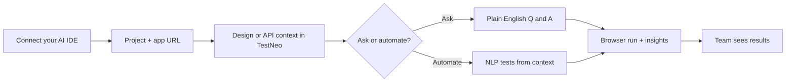

# TestNeo MCP — Web AI Assistant & prompt library

**Purpose:** Publish-ready guide for using **`testneo_ai_assistant_query`** from MCP (same backend as the product **Web AI Assistant** at **`/web/ai-assistant`**) plus copy-paste **prompts** for document Q&A, analytics, and persona-driven release reviews.

**Docs alignment:** Maintained with [Golden prompt packs](./mcp-prompt-packs.md) (**At a glance** journey, **Question combinations**, **Persona prompts — Web AI Assistant**, **Manager → CEO shareout**, **AI-Q routing**, **Sample Project 1**). **Last aligned:** 2026-05-15.

**Canonical location:** `docs/mcp/mcp-ai-assistant-and-prompts.md` in the TestNeo API monorepo.  
**Related:** [MCP tool reference](./MCP_TOOL_REFERENCE.md) · Quickstart, prompt packs, and context discovery: [testneo.ai — MCP docs](https://testneo.ai/docs/testneo-mcp.html)

---

## Shareable journey (non-technical)

Same story as [Golden prompt packs — At a glance](./mcp-prompt-packs.md#at-a-glance-one-journey-shareable), in one picture:



**MCP angle:** the IDE calls TestNeo tools so the assistant uses **the same data** as the product; sensitive steps stay **guarded**. Install: [MCP quickstart](./mcp-quickstart.md).

---

## What `testneo_ai_assistant_query` does

| Item | Detail |
|------|--------|
| **Backend** | `POST /api/web/v1/etl/ai-assistant/query` (same as the browser UI) |
| **Auth** | Uses your **`TESTNEO_API_KEY`** (MCP server) — same account as the app |
| **Quota** | Counts against **Web AI chat** limits (see response **`usage`**) |
| **Timeout** | Long LLM budget via **`TESTNEO_MCP_SWAGGER_TIMEOUT_MS`** (default **120000** ms) on the MCP server |

**Without** `context_id` / `context_name_query`, the assistant uses **project-wide analytics** context (similar to choosing a project but no document in the UI).  
**With** `context_id` **or** `context_name_query`, answers are **scoped to that unified context** (Figma/PDF/requirements ingest).

---

## Tool parameters (MCP)

| Parameter | Required | Description |
|-----------|----------|-------------|
| **`project_id`** | Yes | Web automation project id |
| **`query`** | Yes | Natural-language question (up to **32000** characters) |
| **`context_id`** | No | Numeric unified context id |
| **`context_name_query`** | No | Human label fragment (e.g. `"Figma"`, `"figma checkout"`). MCP resolves via the same rules as **`testneo_get_unified_context_by_name`**. Do not pass both **`context_id`** and **`context_name_query`** unless you intend **`context_id`** to win. |
| **`context_match_mode`** | No | `auto` (default) \| `exact` \| `substring` |
| **`prefer_context_id`** | No | Disambiguate when several contexts match |
| **`response_style`** | No | `concise` \| `detailed` (matches UI styles) |
| **`recommend_context`** | No | Optional JSON object — **AI-Q** / recommendation payload (advanced; same idea as web body) |
| **`rag_context`** | No | Optional JSON object — document-aware RAG controls (advanced; same idea as web body) |

---

## Response shape (`testneo_mcp_ai_assistant.v1`)

| Field | Meaning |
|-------|---------|
| **`assistant_reply`** | Main answer text for chat / stakeholders |
| **`context_id`** | Resolved context id, or **`null`** for project-wide |
| **`context_resolution`** | When **`context_name_query`** was used: match hint, ambiguity candidates, or error **`context_not_resolved`** |
| **`product_navigation.web_ai_assistant_url`** | Link to **`…/web/ai-assistant`** (respects **`TESTNEO_WEB_APP_URL`** in MCP) |
| **`usage`** | Web AI quota snapshot when returned by API |
| **`upstream`** | Full API JSON for debugging / advanced agents |

---

## Data-backed release reviews (recommended pattern)

The assistant may summarize **execution** or **requirements** using **project analytics** context. **Execution counts and pass rates** can differ between **analytics** and **workflow** endpoints depending on how much history exists — for **go / no-go** decisions, combine tools:

1. **`testneo_run_agent_workflow`** with **`workflow_type`: `"qa_intelligence_workflow"`** — structured failures, triage bundles, rerun preview.  
2. Optionally **`testneo_get_pass_fail_trend`**, **`testneo_list_recent_executions`**, **`testneo_search_failures`**.  
3. **`testneo_ai_assistant_query`** with **no** context (or with context) and a prompt such as:  
   *“Synthesize the following JSON into a one-page executive memo. Do not invent metrics not present in the payload.”*  
   (Paste compact JSON from step 1–2.)

That pattern is stronger than “chat with PDF only” products: **ground truth from TestNeo** + **narrative** from the assistant.

---

## NLP / Swagger API test chains (Multi Test Runner parity)

When the user asks **which NLP/API suite to run**, **recommended ordering**, or **business-flow chains** (Swagger-derived tests, `METHOD /path` steps), prefer **tool-grounded** data instead of guessing `@tags`:

| Tool | Role |
|------|------|
| **`testneo_suggest_api_test_chains`** | Read-only scan: **`GET …/projects/{id}/api-test-chains/suggest`** — returns **`chains`**, **`phases`**, and summaries aligned with the in-product Multi Test Runner. |
| **`testneo_list_saved_api_test_chains`** | Lists named suites the user saved in the app. |
| **`testneo_save_api_test_chain`** | Guarded write — persist **`test_case_ids`** + **`name`** (optional **`description`**); **`confirm=true`**. |
| **`testneo_run_api_test_chain`** | Guarded write — **`POST …/multi-test-runs/create`** + **`…/execute`** with **`preserve_test_case_order: true`**. Pass **either** **`test_case_ids`** (ordered list copied from suggest output) **or** **`saved_chain_id`** — never both, never neither. Same **`use_agent`** / local-agent wait behavior as **`testneo_run_batch_by_tags`**. |
| **`testneo_delete_saved_api_test_chain`** | Guarded write — remove a saved suite by id. |

**Agent playbook:** (1) call **`testneo_suggest_api_test_chains`**; (2) pick the chain whose title/steps match the user goal and cite **`test_case_ids`** or **`saved_chain_id`**; (3) only after explicit approval with **`confirm=true`**, call **`testneo_run_api_test_chain`**. Use **`testneo_ai_assistant_query`** only to *explain* chain JSON in stakeholder language — do not invent suites absent from suggest/list responses.

Details: [MCP tool reference — Read tools](./mcp-tool-reference.md#readanalysis-tools) and guarded execution rows.

---

## Combination recipes (MCP then assistant)

These are **two-step** (or **three-step**) patterns: MCP returns **facts**; **`testneo_ai_assistant_query`** (or plain chat) turns them into **stakeholder language**. A fuller **tool × audience** matrix lives in [Golden prompt packs — Question combinations](./mcp-prompt-packs.md#question-combinations-tools-and-follow-ups).

| Recipe | Step 1 | Step 2 (`testneo_ai_assistant_query`) |
|--------|--------|----------------------------------------|
| **A — Workflow → memo** | `qa_intelligence_workflow` or `triage_failure_workflow` | `project_id` + **`query`**: “Synthesize **only** the prior JSON; 4 sections: summary, themes, risks, next actions.” Optional **`response_style`**: `detailed`. |
| **B — Bundle → postmortem** | `testneo_get_failure_bundle` (+ optional `get_execution_summary`) | Same; paste or refer to bundle JSON in **`query`** explicitly. |
| **C — Trend + runs → weekly update** | `testneo_get_pass_fail_trend` + `testneo_list_recent_executions` | `query`: “Weekly email for leadership; cite counts and dates from prior tools only.” |
| **D — Context doc → release risk** | `testneo_list_unified_contexts` (pick name) | **`context_name_query`** + `query`: persona from [Persona packs](#persona-packs-same-tool-tune-the-query) (e.g. release readiness). |
| **E — Workflow → assistant → second context** | `qa_intelligence_workflow` | (1) Project-wide `query` concise; (2) **`context_name_query`** + `query` detailed on design risk **conditional** on unresolved themes from (1). |
| **F — Sparse data honesty** | Any workflow returning **`unknown_needs_manual_triage`** or **low** volume | `query`: “State clearly that themes are **not** clusterable; list **instrumentation** and **process** next steps (tagging, finish runs, agent connectivity).” |
| **G — COE / CFO one-pager** | `qa_intelligence_workflow` + **`testneo_get_pass_fail_trend`** + **`testneo_list_recent_executions`** | `testneo_ai_assistant_query`: leadership memo **only** from those JSON payloads; optional **second** assistant call with explicit **assumption** block for illustrative dollar scenarios (never as audited fact). |
| **H — CEO strategic brief** | Same three tools as **G** | `testneo_ai_assistant_query`: **CEO** narrative (customer trust, scale vs stabilize, one decision)—facts from JSON only; no finance detail unless assumptions block in a follow-up. |
| **I — Manager → CEO business report** | Same three tools as **G** | **Cursor synthesis** (recommended): paste JSON + `BUSINESS_ASSUMPTIONS` in chat. Optional `testneo_ai_assistant_query` with [safe wording](#ai-q-routing-important-for-testneo_ai_assistant_query); see [Sample — Project 1](#sample--project-1-acme-b2b-saas-tested). |
| **J — Manager → CEO (Cursor only)** | Same three tools as **G** | No assistant call: manager pastes **BUSINESS_ASSUMPTIONS** + three JSON blobs; agent writes CEO memo (revenue exposure, customer impact, OSI). [Golden prompt packs — C14](./mcp-prompt-packs.md#c14--manager--ceo-cursor-synthesis-recommended). |
| **K — Chain scan → narrative → run** | **`testneo_suggest_api_test_chains`** (and optionally **`testneo_list_saved_api_test_chains`**) | `testneo_ai_assistant_query`: “Explain **only** the suggested suites JSON — names, step counts, which fits `<USER_GOAL>`; list **`test_case_ids`** for the best match.” Execution stays **`testneo_run_api_test_chain`** with **`confirm=true`** when the user approves; share **`ui_navigation.multi_test_runner_url`**. **Fastest path:** [C16](./mcp-prompt-packs.md#c16--simplest-api-chain-smoke-start-here). **Full variants (Store/Pet/Customers, save+run, triage):** [C15](./mcp-prompt-packs.md#c15--suggested-api-chains--pick-suite--optional-explain--run). |

**Single-message two-tool prompt (copy-paste)** — assistant second call must **not** hallucinate metrics absent from the first response:

```text
First call testneo_run_agent_workflow with workflow_type "qa_intelligence_workflow", project_id <PROJECT_ID>, range "30d", top_failures 5, rerun_limit 5.

Then call testneo_ai_assistant_query with the same project_id, response_style "concise", query "You are given the exact JSON output of testneo_run_agent_workflow from the immediately previous message in this thread. Summarize: (1) execution_summary, (2) recurring_themes, (3) one business tradeoff — stability work vs new features — and (4) if data is too sparse for roadmap decisions, say so and name what evidence we need next. Do not invent execution counts or themes not present in that JSON."
```

If your client **does not** pass prior tool JSON into the assistant automatically, paste the **compact** workflow JSON into the **`query`** inside a fenced block or quoted string (same instruction: **do not invent**).

### C-suite memos (CEO / CFO / COE) — copy-paste for testing

Use when you want **leadership** stories grounded in **execution intelligence** (not document RAG). TestNeo stores **runs, pass/fail, themes, triage**; it does **not** know your cost model, customers, or market unless you add them in a clearly labeled **assumptions** block.

**Who runs MCP:** Usually **engineering / QA / COE** (`project_id` in tools). The **CEO does not need to know the project id**—you generate the narrative here, then **paste the final memo** into email, Slack, or a deck. Add a **cover sheet** line in the `query` (product name, business area, reporting window) so the output stands alone.

#### AI-Q routing (important for `testneo_ai_assistant_query`)

The Web AI backend may **auto-route** your `query` to **AI-Q modes** (Explain / Predict / Recommend) **before** it reads embedded JSON. Those modes use **different tables** than MCP analytics (`qa_intelligence_workflow`, `pass_fail_trend`, `list_recent_executions`), so you can get misleading replies (e.g. “no recent failures”, “0% pass”, “613 tests”) even when MCP shows good data.

| If your `query` contains… | Often routes to | Symptom |
|---------------------------|-----------------|---------|
| **explain**, **why did … fail**, **analyze failure**, **root cause** | Explain | “No recent failures found” |
| **at risk**, **high risk**, **likely to fail** | Predict | Failure-prediction boilerplate |
| **executive summary**, **project health**, **recommend next steps** | Recommend | Executive summary from **other** DB metrics |

**Recommended path for Manager → CEO memos (tested):**

1. Run the **three MCP tools** (facts).  
2. Paste **`BUSINESS_ASSUMPTIONS`** + compact tool JSON into **Cursor chat** (or your MCP client) and ask for the CEO report—**do not rely on the assistant tool alone** for JSON-only synthesis.  
3. Optional: try `testneo_ai_assistant_query` with **executive summary** wording and **no** phrases in the table above; use **revenue exposure** (not **revenue at risk**) in the `query` text. If the reply ignores your JSON, use step 2.

See [Sample — Project 1 (Acme B2B SaaS)](#sample--project-1-acme-b2b-saas-tested) for a full walkthrough with mock revenue and example metrics.

**Shared data pull (run once for CEO or CFO)** — three MCP tools, then the assistant or Cursor synthesis. If your client does not thread prior tool output into the model, paste the three compact JSON blobs into the placeholder.

```text
Call testneo_run_agent_workflow with workflow_type "qa_intelligence_workflow", project_id <PROJECT_ID>, range "30d", top_failures 5, rerun_limit 5.

Call testneo_get_pass_fail_trend with project_id <PROJECT_ID>, range "30d", limit 200.

Call testneo_list_recent_executions with project_id <PROJECT_ID>, limit 25.
```

**CEO — Facts-only strategic brief (recommended first)** — run the shared pull above, then:

```text
Call testneo_ai_assistant_query with project_id <PROJECT_ID>, response_style "concise", query "You have three JSON tool responses in order: (1) qa_intelligence_workflow, (2) pass_fail_trend, (3) recent_executions. If they are not visible in this thread, I paste them here: <<<PASTE_COMPACT_JSON_FROM_THREE_TOOLS>>>. Write a CEO brief (max 200 words) with sections: (1) One-sentence headline on whether we can confidently scale customer-facing delivery on this product, (2) Customer and reputation risk in plain language—no invented incidents or customer names, (3) Trend direction (improving / flat / degrading) with evidence only from the JSON, (4) Strategic fork: accelerate roadmap vs stabilization sprint—your recommendation and why, (5) Exactly one decision you need from the CEO this week. Rules: no jargon; use only numbers, dates, and themes in that JSON; if sample size is small or sources disagree, say so; do not invent market, revenue, or competitor facts."
```

**CEO — Optional board / investor addendum** — after the CEO brief, same `project_id`:

```text
Call testneo_ai_assistant_query with project_id <PROJECT_ID>, response_style "concise", query "Using ONLY recurring_themes and execution_summary from the qa_intelligence JSON we already used, draft a 90-second board talking script (max 150 words): quality posture, what could embarrass us in market if ignored, and one ask. No dollar figures unless I supplied them. Label anything not in the JSON as unknown."
```

**CFO — Facts-only one-pager** — same shared pull, then:

```text
Call testneo_ai_assistant_query with project_id <PROJECT_ID>, response_style "detailed", query "You have three JSON tool responses in order: (1) qa_intelligence_workflow, (2) pass_fail_trend, (3) recent_executions. If they are not visible in this thread, I paste them here: <<<PASTE_COMPACT_JSON_FROM_THREE_TOOLS>>>. Write a CFO / COE one-pager (max 280 words) with sections: Executive headline, What the data shows about quality, Top operational risks, Stability vs feature-velocity tradeoff, What the COE should prioritize next quarter. Rules: use only numbers, dates, and themes explicitly present in that JSON; if sample size is small or two sources disagree on counts, say so; do not invent dollar ROI or headcount savings."
```

**CFO — Optional illustrative ROI addendum (assumptions only)** — run **after** the CFO one-pager, same `project_id`. Replace the bracketed assumptions with numbers Finance agrees to treat as **scenarios**, not facts from TestNeo.

```text
Call testneo_ai_assistant_query with project_id <PROJECT_ID>, response_style "concise", query "Using ONLY the recurring_themes and execution_summary fields from the qa_intelligence JSON we already used (do not invent new failures), write an addendum of at most 120 words for the CFO. BUSINESS ASSUMPTIONS (not from TestNeo): [e.g. fully loaded QA hour $85; illustrative major-incident cost $120k; assume fixing the top theme reduces expected incidents by 0.5 per quarter]. Label every dollar figure as scenario / assumption-driven; state that TestNeo did not supply financial data; do not present as audited ROI."
```

### Manager → CEO shareout (business bridge: revenue, customer, OSI)

**Why this exists:** Executives care about **revenue at risk**, **customer impact**, and **operational stability**—not raw pass/fail labels. TestNeo gives **evidence** (trends, themes, runs); **you** supply **business context** (which product line, which customers, rough economics) so the assistant can **bridge** honestly.

**Rules**

- **Revenue at risk:** Only with a **`BUSINESS_ASSUMPTIONS`** block **you** write (e.g. ARR touched, cost per severity-1 incident). The model **maps** failure themes to those assumptions; every dollar is **scenario**, not GAAP.
- **Customer impact:** Describe **user-visible journeys** implied by `recurring_themes` and failures—**no** invented customer names, logos, or tickets.
- **Operational Stability Index (OSI):** Not a built-in TestNeo metric. In the prompt below, OSI is a **0–100 index derived in the answer from the three JSON payloads only**, using a **fixed rubric** the model must show (trend strength + run volume + theme severity). If data is sparse, **cap** the index and say so.

**Copy-paste — after the shared data pull** (replace cover sheet and assumptions; paste JSON if needed):

```text
Call testneo_ai_assistant_query with project_id <PROJECT_ID>, response_style "detailed", query "COVER SHEET (manager-provided, not from TestNeo): Product/initiative: <NAME>. Business area / revenue stream it supports: <ONE SENTENCE>. Reporting window: last 30 days. Primary users or journeys executives should have in mind: <SHORT PHRASE>.

DATA: Three JSON tool responses in order: (1) qa_intelligence_workflow, (2) pass_fail_trend, (3) recent_executions. If not in thread, paste here: <<<PASTE_COMPACT_JSON_FROM_THREE_TOOLS>>>.

BUSINESS_ASSUMPTIONS (manager-provided scenarios only—not TestNeo data): <e.g. ~$Xm ARR influenced by checkout reliability; severity-1 incident illustrative cost $Y; we assume top failure theme correlates with Z% of support volume—edit or delete lines you will not stand behind>.

Write a CEO-ready report (max 400 words) with these sections:

1) Executive snapshot — 3 bullets: posture, biggest risk, one ask of leadership.

2) Revenue exposure — Qualitative + optional scenario dollars **only** using BUSINESS_ASSUMPTIONS and themes **explicitly** in the JSON. If assumptions are missing, say revenue impact is unmodeled and stop. (Use **revenue exposure** in the assistant `query` text—not **revenue at risk**—to avoid AI-Q Predict routing.)

3) Customer impact — Translate the top failure themes into **customer-visible** outcomes (failed checkout, broken login, latency, wrong data shown, etc.). Tie each bullet to evidence from the JSON. No invented customers.

4) Operational Stability Index (OSI) — One number 0-100. Compute using **only** fields in the three JSON blobs with this rubric: (a) From trend data: 40 points max for stable or improving pass posture vs declining; (b) From recent_executions: 30 points max for healthy run volume and recency (if very few runs, cap this band at 15 and note sparse evidence); (c) From qa_intelligence themes/triage: 30 points max for low concentration of critical failures vs repeated high-impact themes. State OSI, label band Stable (75-100) / Watch (50-74) / Action (0-49), and one sentence citing which JSON fields moved the score.

5) What we are doing next — 4 bullets grounded in rerun_plan_preview or themes from the JSON, or say what data is missing to plan.

Do not use test case ids or internal tool names in the CEO-facing prose. Do not present OSI or dollar figures as audited or system-generated facts."
```

### Sample — Swag Labs (Sauce Demo, project 49)

([Demo runbook](./mcp-demo-e2e-project-49-runbook.md).) Use **`project_id` `49`** only if that project exists in your tenant and targets **[saucedemo.com](https://www.saucedemo.com)**. **Illustrative** revenue lines below are for **storytelling in a demo**—replace with your real business facts for production exec readouts.

**1) Data pull**

```text
Call testneo_run_agent_workflow with workflow_type "qa_intelligence_workflow", project_id 49, range "30d", top_failures 5, rerun_limit 5.

Call testneo_get_pass_fail_trend with project_id 49, range "30d", limit 200.

Call testneo_list_recent_executions with project_id 49, limit 25.
```

**2) Manager → CEO memo (filled cover sheet + demo assumptions)**

```text
Call testneo_ai_assistant_query with project_id 49, response_style "detailed", query "COVER SHEET (manager-provided, not from TestNeo): Product/initiative: Swag Labs reference store (Sauce Demo). Business area / revenue stream it supports: Illustrative e-commerce demo used for pipeline training—not our production P&L. Reporting window: last 30 days. Primary users or journeys executives should have in mind: login → browse inventory → cart → checkout.

DATA: Three JSON tool responses in order: (1) qa_intelligence_workflow, (2) pass_fail_trend, (3) recent_executions. If not in thread, paste here: <<<PASTE_COMPACT_JSON_FROM_THREE_TOOLS>>>.

BUSINESS_ASSUMPTIONS (demo scenarios only—not TestNeo data): Treat checkout/login stability as if it protected an illustrative $2M ARR demo narrative; illustrative severity-1 incident cost $75k; assume recurring checkout-related failures correlate with up to 15% incremental support load in a comparable production retail app.

Write a CEO-ready report (max 400 words) with these sections:

1) Executive snapshot — 3 bullets: posture, biggest risk, one ask of leadership.

2) Revenue exposure — Qualitative + optional scenario dollars **only** using BUSINESS_ASSUMPTIONS and themes **explicitly** in the JSON. If assumptions are missing, say revenue impact is unmodeled and stop. (Use **revenue exposure** in the assistant `query` text—not **revenue at risk**—to avoid AI-Q Predict routing.)

3) Customer impact — Translate the top failure themes into **customer-visible** outcomes (failed checkout, broken login, cart errors, inventory not loading, etc.). Tie each bullet to evidence from the JSON. No invented customer names.

4) Operational Stability Index (OSI) — One number 0-100. Compute using **only** fields in the three JSON blobs with this rubric: (a) From trend data: 40 points max for stable or improving pass posture vs declining; (b) From recent_executions: 30 points max for healthy run volume and recency (if very few runs, cap this band at 15 and note sparse evidence); (c) From qa_intelligence themes/triage: 30 points max for low concentration of critical failures vs repeated high-impact themes. State OSI, label band Stable (75-100) / Watch (50-74) / Action (0-49), and one sentence citing which JSON fields moved the score.

5) What we are doing next — 4 bullets grounded in rerun_plan_preview or themes from the JSON, or say what data is missing to plan.

Do not use test case ids or internal tool names in the CEO-facing prose. Do not present OSI or dollar figures as audited or system-generated facts. State once that Swag Labs is a reference app so revenue language is illustrative."
```

### Sample — Project 1 (Acme B2B SaaS, tested)

**Tested:** 2026-05-15 on **project `1`** (login journey on [the-internet.herokuapp.com](https://the-internet.herokuapp.com/login)). MCP analytics showed **10** runs, **90%** pass, **improving** trend (+20 pts, 80% → 100%), one **selector_or_dom_drift** theme (invalid-password message verification). `testneo_ai_assistant_query` routed to AI-Q and **did not** synthesize embedded JSON—**Cursor synthesis (step 3)** produced the CEO memo.

**1) Data pull**

```text
Call testneo_run_agent_workflow with workflow_type "qa_intelligence_workflow", project_id 1, range "30d", top_failures 5, rerun_limit 5.

Call testneo_get_pass_fail_trend with project_id 1, range "30d", limit 200.

Call testneo_list_recent_executions with project_id 1, limit 25.
```

**Example metrics from a live run (your tenant may differ):**

| Source | Highlights |
|--------|------------|
| **qa_intelligence_workflow** | `total` 10, `pass_rate_percent` 90, theme `selector_or_dom_drift` (count 1, high confidence), login message text not found |
| **pass_fail_trend** | `sample_size` 10, `direction` improving, `pass_rate_delta_percent` 20 |
| **recent_executions** | release `1.0`, build `1.0.0`, `batch_execution`, chromium |

**2) Mock `BUSINESS_ASSUMPTIONS` (paste in chat with the tool JSON)**

```text
BUSINESS_ASSUMPTIONS (manager-provided — scenario only, not from TestNeo):
- Product: Acme B2B SaaS — Customer Portal login & session.
- ARR influenced by this login journey: $2,400,000 annually (~$600,000 per quarter).
- Blended cost of one severity-1 login outage: $180,000 (support + recovery + partial churn).
- If login error messaging regresses in production, up to 8% of quarterly support tickets may tie to login confusion (scenario).
- Fixing the top automation gap may reduce undetected login regressions by 25% over the next quarter (scenario).
```

**3) CEO memo — Cursor synthesis (recommended)**

After the three MCP calls, paste this in chat **without** calling `testneo_ai_assistant_query`:

```text
Using ONLY the three TestNeo MCP tool JSON responses above and BUSINESS_ASSUMPTIONS below, write a CEO-ready report (max 400 words).

Sections: (1) Executive snapshot — 3 bullets, (2) Revenue exposure — scenario dollars labeled, (3) Customer impact, (4) Operational Stability Index 0-100 with Stable/Watch/Action band and rubric (trend 40 + volume 30 + themes 30), (5) Four next steps.

Do not invent customers or audited financials. No test IDs or tool names in prose.

BUSINESS_ASSUMPTIONS:
- ARR touched $2.4M annual (~$600k/quarter). Severity-1 login outage $180k blended.
- Up to 8% support tickets login-related if messaging regresses.
- Fixing automation gap may reduce undetected login regressions 25% next quarter.
```

**4) Optional — `testneo_ai_assistant_query` (may ignore embedded JSON)**

Use **executive summary** / **project status** wording; avoid **explain**, **failure analysis**, and the phrase **at risk**:

```text
Call testneo_ai_assistant_query with project_id 1, response_style "detailed", query "Give me a high level executive summary for the CEO. Overall project status for the last 30 days. Recommend next steps for leadership. Use ONLY the embedded METRICS and BUSINESS_ASSUMPTIONS below.

COVER SHEET: Acme B2B SaaS Customer Portal login journey.

BUSINESS_ASSUMPTIONS (scenario only): ARR touched $2.4M annual (~$600k per quarter). Severity-1 login outage cost $180k blended. Up to 8% support tickets may tie to login confusion if messaging regresses. Fixing automation gap may reduce undetected login regressions 25% next quarter.

METRICS: 10 runs, 90% pass rate, 9 passed 1 did not pass, trend improving +20 points from 80% to 100% between halves of window. Theme: selector_or_dom_drift on login invalid-password message verification (high confidence). Login page loaded; message text check did not match.

Write CEO report max 400 words: executive snapshot, revenue exposure with scenario dollars labeled, customer impact, Operational Stability Index 0-100 with band, four recommended next steps. No technical IDs in prose."
```

**5) Example CEO memo output (reference — from MCP facts + mock assumptions above)**

**Executive snapshot**

- **Posture:** Stable and improving — **90%** success on **10** runs; trend up **20** points (80% → 100% in the second half of the window).
- **Biggest risk:** Automation brittleness on login error messaging (selector/copy drift)—can hide real login UX problems; not proof of a customer outage in this window.
- **Ask:** Approve one sprint to harden login negative-path checks on every **1.0** release build.

**Revenue exposure** *(scenario only)*

- Unclear login errors can drive retries, support volume, and trust loss at the product front door.
- Scenario: **~$600k/quarter** ARR touched × **25%** undetected-regression reduction if we fix the gap → **~$150k/quarter** mitigation opportunity (scenario).
- Scenario: one severity-1 login event × **$180k** → **$180k** per event (scenario).

**Customer impact**

- Users may not see a clear invalid-password message → more retries and abandoned sessions.
- Login page loaded; expected error text was not detected—likely test/locator drift, not confirmed broad customer harm in 30 days.

**Operational Stability Index**

- **OSI: 91 — Stable (75–100)** (trend improving +20%, n=10, one high-confidence drift theme).

**Next steps**

- Stabilize locators for login error state (role/container, not copy-only).
- Re-run login negative path on build **1.0.0** after the change.
- Add daily smoke on login (not only one batch).
- Refresh executive summary next month with **≥20** runs for stronger OSI confidence.

---

## Copy-paste prompts — document / unified context

Use **`context_name_query`** (or **`context_id`**) + **`response_style`: `"detailed"`** unless you want short bullets.

**Ambiguity and PM clarifications**

```text
List ambiguous or conflicting requirements in this context. For each, quote the shortest supporting phrase and propose one clarification question for the PM.
```

**Deep summary + test ideas**

```text
Summarize what this context contains (sources, main flows, and any risks). Then list 5 concrete test ideas we should automate first.
```

**Negative tests (concise, one line each)**

```text
Propose 8 negative tests a human would catch that happy-path automation usually misses. One line each.
```

**Traceability (conceptual)**

```text
Build a traceability sketch: requirements → implied user journeys → suggested test themes (conceptual only, no execution IDs).
```

**Edge cases for a flow (edit the area name)**

```text
For checkout and payment, what are the top 8 edge cases this context supports versus what is not specified?
```

---

## Copy-paste prompts — project analytics (no context)

Omit **`context_id`** and **`context_name_query`**. Use **`response_style`: `"detailed"`** for memos.

**Release readiness (four sections)**

```text
Act as a release readiness reviewer. Summarize quality risk in 4 sections: (1) trend of failures vs passes if you have execution context, (2) top 3 risk themes, (3) go / no-go / go-with-conditions with explicit conditions, (4) next 5 actions for QA and Eng. If you lack execution facts, say exactly what is missing.
```

**Executive health (short)**

```text
Give an executive summary of test health for this project in under 200 words. Explicitly list what data you used and what is missing.
```

---

## Persona packs (same tool; tune the `query`)

Use these **verbatim** in the **Web AI Assistant** query box (pick project + optional context in the UI). In **Cursor / MCP**, the same strings go in **`query`** on **`testneo_ai_assistant_query`** — copy-ready **`Call …`** lines live in [Golden prompt packs — Persona prompts: Web AI Assistant](./mcp-prompt-packs.md#persona-prompts-web-ai-assistant-testneo_ai_assistant_query).

Replace **`<area>`** or **`<design fragment>`** with your wording.

### Engineering / QA manager

```text
Act as an engineering director. Can we release this week? Answer go / no-go / go-with-conditions and list three measurable exit criteria. If you lack data, say what is missing.
```

```text
If we slip quality work by one sprint, what debt do we pay—rank top 5 by severity for leadership.
```

```text
Draft a 150-word stakeholder email: current quality story, top risk, and one decision we need from leadership this week.
```

### QA lead

```text
Propose a 7-day pre-release test plan: goals, scope, environments, exit criteria, and daily checkpoints.
```

```text
Which failure modes should we target first—rank by customer impact × likelihood × cost to verify (qualitative is fine).
```

```text
What three questions should daily standup ask about quality this week based on project signals only?
```

### Developer

```text
Before we refactor the <area> module, what highest-leverage automated tests should we add—avoid overlapping coverage we likely already have.
```

```text
List observable assertions that belong in UI tests vs API-only checks for the same user flows.
```

```text
Give a bullet checklist of edge cases for login and session handling—conceptual only, no execution IDs needed.
```

### Product / program

```text
Scope-risk review: what did we promise in the requirements that is hard to verify automatically? List each with one mitigation.
```

```text
Launch checklist beyond all tests green: what must be true for support, sales, and compliance before we announce?
```

```text
In five bullets: what should roadmap cut or defer if quality is the gating concern this month?
```

### Security / privacy (document-heavy contexts)

```text
From this context, list PII touchpoints and trust boundaries; what tests prove we do not leak data across boundaries?
```

```text
What abuse or fraud scenarios are implied but not explicitly specified—propose test themes only.
```

### Executive / sponsor

```text
60-second readout for a non-technical exec: are we green to grow the team on this product, or should we invest in stabilization first?
```

```text
One-page brief: customer-visible quality story, dollarized risk framing (qualitative), and two investment options with tradeoffs.
```

### CEO

Use **project-wide** queries (no `context_*`) unless you want design-linked launch risk. For **data-backed** CEO briefs after MCP pulls, see [C-suite memos (CEO / CFO / COE)](#c-suite-memos-ceo--cfo--coe--copy-paste-for-testing). For a **manager → CEO** pack (revenue at risk, customer impact, **Operational Stability Index**), see [Manager → CEO shareout](#manager--ceo-shareout-business-bridge-revenue-customer-osi). MCP **`Call …`** lines: [Golden prompt packs — CEO](./mcp-prompt-packs.md#ceo-project-wide).

```text
90-second board narrative: quality posture for this product, what could embarrass us in market if we ignore it, and the one decision you need from me—cite only data you actually have.
```

```text
From execution and trend signals only: should we announce or expand this capability to customers now, or pause for a stabilization sprint? Answer go / pause / go-with-conditions in under 150 words.
```

```text
What is the single biggest reputational or customer-trust risk visible in our test health data? If the data is too thin, say what we must measure before you can answer.
```

```text
Strategic fork: double down on new features vs invest one quarter in quality foundations—which does our current execution history support, and what would change your mind?
```

```text
Are we learning from failures fast enough to stay ahead of regressions? Answer for a CEO audience in five bullets—no test IDs or tool names.
```

```text
If I have only two minutes before a customer call: what is our honest quality story, what must we not promise, and what is improving?
```

### Designer / UX

```text
List ambiguous UI states or microcopy that will confuse QA automation—suggest clarifications we should add to the design file.
```

```text
Top five accessibility or empty-state risks implied by this design—short bullets only.
```

---

## Example MCP tool arguments (JSON)

**Scoped to a context by name**

```json
{
  "project_id": 49,
  "context_name_query": "Figma",
  "context_match_mode": "auto",
  "response_style": "detailed",
  "query": "Summarize what this context contains (sources, main flows, and any risks). Then list 5 concrete test ideas we should automate first."
}
```

**Project-wide analytics**

```json
{
  "project_id": 49,
  "response_style": "detailed",
  "query": "Act as a release readiness reviewer. Summarize quality risk in 4 sections: (1) trend of failures vs passes if you have execution context, (2) top 3 risk themes, (3) go / no-go / go-with-conditions with explicit conditions, (4) next 5 actions for QA and Eng. If you lack execution facts, say exactly what is missing."
}
```

**Pinned context id** (when you already resolved id **106**, for example)

```json
{
  "project_id": 49,
  "context_id": 106,
  "response_style": "concise",
  "query": "Propose 8 negative tests a human would catch that happy-path automation usually misses. One line each."
}
```

---

## Prerequisites and limits

- **Feature access:** Account must have **Web AI Assistant** entitlement (same as UI).  
- **Subscription / trial:** API may return **403** with upgrade hints when limits are hit — MCP surfaces the same errors.  
- **Web automation commands:** Some natural-language patterns can trigger **web automation** handling on the server (documented product behavior); treat prompts like production inputs.  
- **Context not found:** If **`context_name_query`** does not resolve uniquely, MCP returns **`error`: `context_not_resolved`** and candidate ids — narrow the query or pass **`prefer_context_id`**.  
- **CEO memos via assistant:** AI-Q routing may ignore pasted JSON; prefer **MCP tools + Cursor synthesis** — see [AI-Q routing](#ai-q-routing-important-for-testneo_ai_assistant_query) and [Sample — Project 1](#sample--project-1-acme-b2b-saas-tested).

---

## Website and package sync

| Audience | File |
|----------|------|
| **testneo.ai / marketing / docs site** | Publish from **`docs/mcp/mcp-ai-assistant-and-prompts.md`** (this file). |
| **npm `@testneo/mcp-server` bundle** | Optionally copy into **`packages/testneo-mcp-server/docs/`** when you ship a docs tarball alongside the package. |

---

## Changelog (documentation)

- **2026-05-15** — **AI-Q routing** table + **recommended Cursor synthesis** path; [Sample — Project 1](#sample--project-1-acme-b2b-saas-tested) with mock `BUSINESS_ASSUMPTIONS`, live example metrics, and reference CEO memo output.  
- **2026-05-14** — **Sauce Demo sample** (project `49`, Swag Labs cover sheet) under [Manager → CEO shareout](#manager--ceo-shareout-business-bridge-revenue-customer-osi).  
- **2026-05-14** — Golden [prompt packs](./mcp-prompt-packs.md): **C13**, combination-matrix row, and alignment note for **Manager → CEO shareout** (revenue at risk, customer impact, OSI).  
- **2026-05-13** — **Manager → CEO shareout**: revenue at risk (assumption-driven), customer impact, **Operational Stability Index (OSI)** rubric from JSON-only; who runs MCP vs who reads the memo.  
- **2026-05-13** — **CEO** strategic brief + persona questions; **C-suite memos** section (shared MCP pull, CEO + CFO chains).  
- **2026-05-12** — **CFO / COE memo** copy-paste chain (workflow + trend + recent runs → assistant; optional assumptions-only ROI addendum) under [Combination recipes](#combination-recipes-mcp-then-assistant).  
- **2026-05-12** — **Docs alignment** with [Golden prompt packs](./mcp-prompt-packs.md): shareable journey diagram, expanded **Persona packs** (UI `query` text + link to MCP `Call …` lines), clarified sync date.  
- **2026-05-14** — Initial publish: **`testneo_ai_assistant_query`**, prompt library, persona packs, data-backed release pattern.
