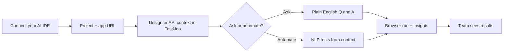

# TestNeo MCP — Web AI Assistant & prompt library

**Purpose:** Publish-ready guide for using **`testneo_ai_assistant_query`** from MCP (same backend as the product **Web AI Assistant** at **`/web/ai-assistant`**) plus copy-paste **prompts** for document Q&A, analytics, and persona-driven release reviews.

**Docs alignment:** Maintained with [Golden prompt packs](./mcp-prompt-packs.md) (**At a glance** journey, **Question combinations**, **Persona prompts — Web AI Assistant**). **Last aligned:** 2026-05-12.

**Canonical location:** `docs/mcp/mcp-ai-assistant-and-prompts.md` in the TestNeo API monorepo.  
**Related:** [MCP tool reference](./MCP_TOOL_REFERENCE.md) · Quickstart, prompt packs, and context discovery: [testneo.ai — MCP docs](https://testneo.ai/docs/testneo-mcp.html)

---

## Shareable journey (non-technical)

Same story as [Golden prompt packs — At a glance](./mcp-prompt-packs.md#at-a-glance-one-journey-shareable), in one picture:



**MCP angle:** the IDE calls TestNeo tools so the assistant uses **the same data** as the product; sensitive steps stay **guarded**. Install: [MCP quickstart](./mcp-quickstart.md).

---

## What `testneo_ai_assistant_query` does

| Item | Detail |
|------|--------|
| **Backend** | `POST /api/web/v1/etl/ai-assistant/query` (same as the browser UI) |
| **Auth** | Uses your **`TESTNEO_API_KEY`** (MCP server) — same account as the app |
| **Quota** | Counts against **Web AI chat** limits (see response **`usage`**) |
| **Timeout** | Long LLM budget via **`TESTNEO_MCP_SWAGGER_TIMEOUT_MS`** (default **120000** ms) on the MCP server |

**Without** `context_id` / `context_name_query`, the assistant uses **project-wide analytics** context (similar to choosing a project but no document in the UI).  
**With** `context_id` **or** `context_name_query`, answers are **scoped to that unified context** (Figma/PDF/requirements ingest).

---

## Tool parameters (MCP)

| Parameter | Required | Description |
|-----------|----------|-------------|
| **`project_id`** | Yes | Web automation project id |
| **`query`** | Yes | Natural-language question (up to **32000** characters) |
| **`context_id`** | No | Numeric unified context id |
| **`context_name_query`** | No | Human label fragment (e.g. `"Figma"`, `"figma checkout"`). MCP resolves via the same rules as **`testneo_get_unified_context_by_name`**. Do not pass both **`context_id`** and **`context_name_query`** unless you intend **`context_id`** to win. |
| **`context_match_mode`** | No | `auto` (default) \| `exact` \| `substring` |
| **`prefer_context_id`** | No | Disambiguate when several contexts match |
| **`response_style`** | No | `concise` \| `detailed` (matches UI styles) |
| **`recommend_context`** | No | Optional JSON object — **AI-Q** / recommendation payload (advanced; same idea as web body) |
| **`rag_context`** | No | Optional JSON object — document-aware RAG controls (advanced; same idea as web body) |

---

## Response shape (`testneo_mcp_ai_assistant.v1`)

| Field | Meaning |
|-------|---------|
| **`assistant_reply`** | Main answer text for chat / stakeholders |
| **`context_id`** | Resolved context id, or **`null`** for project-wide |
| **`context_resolution`** | When **`context_name_query`** was used: match hint, ambiguity candidates, or error **`context_not_resolved`** |
| **`product_navigation.web_ai_assistant_url`** | Link to **`…/web/ai-assistant`** (respects **`TESTNEO_WEB_APP_URL`** in MCP) |
| **`usage`** | Web AI quota snapshot when returned by API |
| **`upstream`** | Full API JSON for debugging / advanced agents |

---

## Data-backed release reviews (recommended pattern)

The assistant may summarize **execution** or **requirements** using **project analytics** context. **Execution counts and pass rates** can differ between **analytics** and **workflow** endpoints depending on how much history exists — for **go / no-go** decisions, combine tools:

1. **`testneo_run_agent_workflow`** with **`workflow_type`: `"qa_intelligence_workflow"`** — structured failures, triage bundles, rerun preview.  
2. Optionally **`testneo_get_pass_fail_trend`**, **`testneo_list_recent_executions`**, **`testneo_search_failures`**.  
3. **`testneo_ai_assistant_query`** with **no** context (or with context) and a prompt such as:  
   *“Synthesize the following JSON into a one-page executive memo. Do not invent metrics not present in the payload.”*  
   (Paste compact JSON from step 1–2.)

That pattern is stronger than “chat with PDF only” products: **ground truth from TestNeo** + **narrative** from the assistant.

---

## Combination recipes (MCP then assistant)

These are **two-step** (or **three-step**) patterns: MCP returns **facts**; **`testneo_ai_assistant_query`** (or plain chat) turns them into **stakeholder language**. A fuller **tool × audience** matrix lives in [Golden prompt packs — Question combinations](./mcp-prompt-packs.md#question-combinations-tools-and-follow-ups).

| Recipe | Step 1 | Step 2 (`testneo_ai_assistant_query`) |
|--------|--------|----------------------------------------|
| **A — Workflow → memo** | `qa_intelligence_workflow` or `triage_failure_workflow` | `project_id` + **`query`**: “Synthesize **only** the prior JSON; 4 sections: summary, themes, risks, next actions.” Optional **`response_style`**: `detailed`. |
| **B — Bundle → postmortem** | `testneo_get_failure_bundle` (+ optional `get_execution_summary`) | Same; paste or refer to bundle JSON in **`query`** explicitly. |
| **C — Trend + runs → weekly update** | `testneo_get_pass_fail_trend` + `testneo_list_recent_executions` | `query`: “Weekly email for leadership; cite counts and dates from prior tools only.” |
| **D — Context doc → release risk** | `testneo_list_unified_contexts` (pick name) | **`context_name_query`** + `query`: persona from [Persona packs](#persona-packs-same-tool-tune-the-query) (e.g. release readiness). |
| **E — Workflow → assistant → second context** | `qa_intelligence_workflow` | (1) Project-wide `query` concise; (2) **`context_name_query`** + `query` detailed on design risk **conditional** on unresolved themes from (1). |
| **F — Sparse data honesty** | Any workflow returning **`unknown_needs_manual_triage`** or **low** volume | `query`: “State clearly that themes are **not** clusterable; list **instrumentation** and **process** next steps (tagging, finish runs, agent connectivity).” |

**Single-message two-tool prompt (copy-paste)** — assistant second call must **not** hallucinate metrics absent from the first response:

```text
First call testneo_run_agent_workflow with workflow_type "qa_intelligence_workflow", project_id <PROJECT_ID>, range "30d", top_failures 5, rerun_limit 5.

Then call testneo_ai_assistant_query with the same project_id, response_style "concise", query "You are given the exact JSON output of testneo_run_agent_workflow from the immediately previous message in this thread. Summarize: (1) execution_summary, (2) recurring_themes, (3) one business tradeoff — stability work vs new features — and (4) if data is too sparse for roadmap decisions, say so and name what evidence we need next. Do not invent execution counts or themes not present in that JSON."
```

If your client **does not** pass prior tool JSON into the assistant automatically, paste the **compact** workflow JSON into the **`query`** inside a fenced block or quoted string (same instruction: **do not invent**).

---

## Copy-paste prompts — document / unified context

Use **`context_name_query`** (or **`context_id`**) + **`response_style`: `"detailed"`** unless you want short bullets.

**Ambiguity and PM clarifications**

```text
List ambiguous or conflicting requirements in this context. For each, quote the shortest supporting phrase and propose one clarification question for the PM.
```

**Deep summary + test ideas**

```text
Summarize what this context contains (sources, main flows, and any risks). Then list 5 concrete test ideas we should automate first.
```

**Negative tests (concise, one line each)**

```text
Propose 8 negative tests a human would catch that happy-path automation usually misses. One line each.
```

**Traceability (conceptual)**

```text
Build a traceability sketch: requirements → implied user journeys → suggested test themes (conceptual only, no execution IDs).
```

**Edge cases for a flow (edit the area name)**

```text
For checkout and payment, what are the top 8 edge cases this context supports versus what is not specified?
```

---

## Copy-paste prompts — project analytics (no context)

Omit **`context_id`** and **`context_name_query`**. Use **`response_style`: `"detailed"`** for memos.

**Release readiness (four sections)**

```text
Act as a release readiness reviewer. Summarize quality risk in 4 sections: (1) trend of failures vs passes if you have execution context, (2) top 3 risk themes, (3) go / no-go / go-with-conditions with explicit conditions, (4) next 5 actions for QA and Eng. If you lack execution facts, say exactly what is missing.
```

**Executive health (short)**

```text
Give an executive summary of test health for this project in under 200 words. Explicitly list what data you used and what is missing.
```

---

## Persona packs (same tool; tune the `query`)

Use these **verbatim** in the **Web AI Assistant** query box (pick project + optional context in the UI). In **Cursor / MCP**, the same strings go in **`query`** on **`testneo_ai_assistant_query`** — copy-ready **`Call …`** lines live in [Golden prompt packs — Persona prompts: Web AI Assistant](./mcp-prompt-packs.md#persona-prompts-web-ai-assistant-testneo_ai_assistant_query).

Replace **`<area>`** or **`<design fragment>`** with your wording.

### Engineering / QA manager

```text
Act as an engineering director. Can we release this week? Answer go / no-go / go-with-conditions and list three measurable exit criteria. If you lack data, say what is missing.
```

```text
If we slip quality work by one sprint, what debt do we pay—rank top 5 by severity for leadership.
```

```text
Draft a 150-word stakeholder email: current quality story, top risk, and one decision we need from leadership this week.
```

### QA lead

```text
Propose a 7-day pre-release test plan: goals, scope, environments, exit criteria, and daily checkpoints.
```

```text
Which failure modes should we target first—rank by customer impact × likelihood × cost to verify (qualitative is fine).
```

```text
What three questions should daily standup ask about quality this week based on project signals only?
```

### Developer

```text
Before we refactor the <area> module, what highest-leverage automated tests should we add—avoid overlapping coverage we likely already have.
```

```text
List observable assertions that belong in UI tests vs API-only checks for the same user flows.
```

```text
Give a bullet checklist of edge cases for login and session handling—conceptual only, no execution IDs needed.
```

### Product / program

```text
Scope-risk review: what did we promise in the requirements that is hard to verify automatically? List each with one mitigation.
```

```text
Launch checklist beyond all tests green: what must be true for support, sales, and compliance before we announce?
```

```text
In five bullets: what should roadmap cut or defer if quality is the gating concern this month?
```

### Security / privacy (document-heavy contexts)

```text
From this context, list PII touchpoints and trust boundaries; what tests prove we do not leak data across boundaries?
```

```text
What abuse or fraud scenarios are implied but not explicitly specified—propose test themes only.
```

### Executive / sponsor

```text
60-second readout for a non-technical exec: are we green to grow the team on this product, or should we invest in stabilization first?
```

```text
One-page brief: customer-visible quality story, dollarized risk framing (qualitative), and two investment options with tradeoffs.
```

### Designer / UX

```text
List ambiguous UI states or microcopy that will confuse QA automation—suggest clarifications we should add to the design file.
```

```text
Top five accessibility or empty-state risks implied by this design—short bullets only.
```

---

## Example MCP tool arguments (JSON)

**Scoped to a context by name**

```json
{
  "project_id": 49,
  "context_name_query": "Figma",
  "context_match_mode": "auto",
  "response_style": "detailed",
  "query": "Summarize what this context contains (sources, main flows, and any risks). Then list 5 concrete test ideas we should automate first."
}
```

**Project-wide analytics**

```json
{
  "project_id": 49,
  "response_style": "detailed",
  "query": "Act as a release readiness reviewer. Summarize quality risk in 4 sections: (1) trend of failures vs passes if you have execution context, (2) top 3 risk themes, (3) go / no-go / go-with-conditions with explicit conditions, (4) next 5 actions for QA and Eng. If you lack execution facts, say exactly what is missing."
}
```

**Pinned context id** (when you already resolved id **106**, for example)

```json
{
  "project_id": 49,
  "context_id": 106,
  "response_style": "concise",
  "query": "Propose 8 negative tests a human would catch that happy-path automation usually misses. One line each."
}
```

---

## Prerequisites and limits

- **Feature access:** Account must have **Web AI Assistant** entitlement (same as UI).  
- **Subscription / trial:** API may return **403** with upgrade hints when limits are hit — MCP surfaces the same errors.  
- **Web automation commands:** Some natural-language patterns can trigger **web automation** handling on the server (documented product behavior); treat prompts like production inputs.  
- **Context not found:** If **`context_name_query`** does not resolve uniquely, MCP returns **`error`: `context_not_resolved`** and candidate ids — narrow the query or pass **`prefer_context_id`**.

---

## Website and package sync

| Audience | File |
|----------|------|
| **testneo.ai / marketing / docs site** | Publish from **`docs/mcp/mcp-ai-assistant-and-prompts.md`** (this file). |
| **npm `@testneo/mcp-server` bundle** | Optionally copy into **`packages/testneo-mcp-server/docs/`** when you ship a docs tarball alongside the package. |

---

## Changelog (documentation)

- **2026-05-12** — **Docs alignment** with [Golden prompt packs](./mcp-prompt-packs.md): shareable journey diagram, expanded **Persona packs** (UI `query` text + link to MCP `Call …` lines), clarified sync date.  
- **2026-05-14** — Initial publish: **`testneo_ai_assistant_query`**, prompt library, persona packs, data-backed release pattern.
